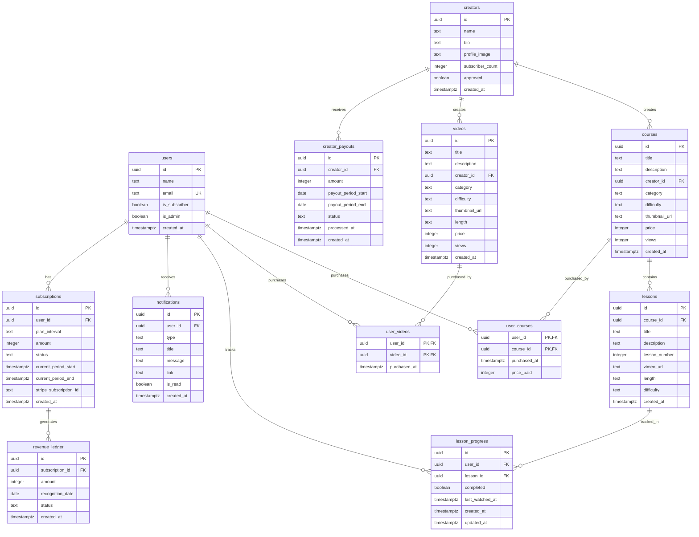

# Grappl 데이터베이스 스키마 문서

## 개요

Grappl은 프리미엄 주짓수 기술 영상 플랫폼으로, Supabase PostgreSQL 데이터베이스를 사용합니다.

## 데이터베이스 ERD



## 테이블 상세 설명

### 핵심 테이블

#### `users`
사용자 정보를 저장하는 테이블. Supabase `auth.users`를 확장합니다.

| 컬럼 | 타입 | 설명 |
|------|------|------|
| `id` | UUID | 기본 키 (auth.users.id 참조) |
| `name` | TEXT | 사용자 이름 |
| `email` | TEXT | 이메일 (고유) |
| `is_subscriber` | BOOLEAN | 구독 여부 |
| `is_admin` | BOOLEAN | 관리자 여부 |
| `created_at` | TIMESTAMPTZ | 생성 시간 |

**RLS 정책:**
- 사용자는 자신의 데이터만 조회/수정 가능

---

#### `creators`
콘텐츠 크리에이터 정보

| 컬럼 | 타입 | 설명 |
|------|------|------|
| `id` | UUID | 기본 키 |
| `name` | TEXT | 크리에이터 이름 |
| `bio` | TEXT | 소개 |
| `profile_image` | TEXT | 프로필 이미지 URL |
| `subscriber_count` | INTEGER | 구독자 수 |
| `approved` | BOOLEAN | 관리자 승인 여부 |
| `created_at` | TIMESTAMPTZ | 생성 시간 |

**RLS 정책:**
- 모든 사용자가 조회 가능
- 관리자만 승인 상태 변경 가능

---

#### `courses`
코스 정보

| 컬럼 | 타입 | 설명 |
|------|------|------|
| `id` | UUID | 기본 키 |
| `title` | TEXT | 코스 제목 |
| `description` | TEXT | 설명 |
| `creator_id` | UUID | 크리에이터 ID (FK) |
| `category` | TEXT | 카테고리 |
| `difficulty` | TEXT | 난이도 |
| `thumbnail_url` | TEXT | 썸네일 URL |
| `price` | INTEGER | 가격 (원) |
| `views` | INTEGER | 조회수 |
| `created_at` | TIMESTAMPTZ | 생성 시간 |

**RLS 정책:**
- 모든 사용자가 조회 가능

---

#### `lessons`
코스 내 개별 레슨

| 컬럼 | 타입 | 설명 |
|------|------|------|
| `id` | UUID | 기본 키 |
| `course_id` | UUID | 코스 ID (FK) |
| `title` | TEXT | 레슨 제목 |
| `description` | TEXT | 설명 |
| `lesson_number` | INTEGER | 레슨 순서 |
| `vimeo_url` | TEXT | Vimeo 비디오 URL |
| `length` | TEXT | 영상 길이 |
| `difficulty` | TEXT | 난이도 |
| `created_at` | TIMESTAMPTZ | 생성 시간 |

**인덱스:**
- `course_id`, `lesson_number`

**RLS 정책:**
- 모든 사용자가 조회 가능

---

### 관계 테이블

#### `user_courses`
사용자가 구매한 코스

| 컬럼 | 타입 | 설명 |
|------|------|------|
| `user_id` | UUID | 사용자 ID (PK, FK) |
| `course_id` | UUID | 코스 ID (PK, FK) |
| `purchased_at` | TIMESTAMPTZ | 구매 시간 |
| `price_paid` | INTEGER | 결제 금액 |

**RLS 정책:**
- 사용자는 자신이 구매한 코스만 조회 가능
- 사용자는 자신의 구매 기록만 생성 가능

---

#### `lesson_progress`
레슨 학습 진도 추적

| 컬럼 | 타입 | 설명 |
|------|------|------|
| `id` | UUID | 기본 키 |
| `user_id` | UUID | 사용자 ID (FK) |
| `lesson_id` | UUID | 레슨 ID (FK) |
| `completed` | BOOLEAN | 완료 여부 |
| `last_watched_at` | TIMESTAMPTZ | 마지막 시청 시간 |
| `created_at` | TIMESTAMPTZ | 생성 시간 |
| `updated_at` | TIMESTAMPTZ | 수정 시간 (자동 갱신) |

**고유 제약:** `(user_id, lesson_id)`

**RLS 정책:**
- 사용자는 자신의 진도만 조회/생성/수정 가능

---

### 기능 테이블

#### `notifications`
사용자 알림

| 컬럼 | 타입 | 설명 |
|------|------|------|
| `id` | UUID | 기본 키 |
| `user_id` | UUID | 사용자 ID (FK) |
| `type` | TEXT | 알림 타입 (info/success/warning/error) |
| `title` | TEXT | 제목 |
| `message` | TEXT | 메시지 |
| `link` | TEXT | 링크 (선택) |
| `is_read` | BOOLEAN | 읽음 여부 |
| `created_at` | TIMESTAMPTZ | 생성 시간 |

**RLS 정책:**
- 사용자는 자신의 알림만 조회/수정 가능

---

#### `subscriptions`
구독 정보

| 컬럼 | 타입 | 설명 |
|------|------|------|
| `id` | UUID | 기본 키 |
| `user_id` | UUID | 사용자 ID (FK) |
| `plan_interval` | TEXT | 구독 주기 (month/year) |
| `amount` | INTEGER | 금액 |
| `status` | TEXT | 상태 (active/cancelled/past_due) |
| `current_period_start` | TIMESTAMPTZ | 현재 기간 시작 |
| `current_period_end` | TIMESTAMPTZ | 현재 기간 종료 |
| `stripe_subscription_id` | TEXT | Stripe 구독 ID |
| `created_at` | TIMESTAMPTZ | 생성 시간 |

---

#### `revenue_ledger`
수익 인식 원장 (발생주의 회계)

| 컬럼 | 타입 | 설명 |
|------|------|------|
| `id` | UUID | 기본 키 |
| `subscription_id` | UUID | 구독 ID (FK) |
| `amount` | INTEGER | 인식 금액 (예: 연간 구독료 / 12) |
| `recognition_date` | DATE | 수익 인식 날짜 |
| `status` | TEXT | 상태 (pending/recognized/refunded) |
| `created_at` | TIMESTAMPTZ | 생성 시간 |

**용도:** 연간 구독의 경우 12개월로 나누어 매월 수익을 인식

---

#### `creator_payouts`
크리에이터 정산

| 컬럼 | 타입 | 설명 |
|------|------|------|
| `id` | UUID | 기본 키 |
| `creator_id` | UUID | 크리에이터 ID (FK) |
| `amount` | INTEGER | 정산 금액 |
| `payout_period_start` | DATE | 정산 기간 시작 |
| `payout_period_end` | DATE | 정산 기간 종료 |
| `status` | TEXT | 상태 (draft/processing/paid) |
| `processed_at` | TIMESTAMPTZ | 처리 시간 |
| `created_at` | TIMESTAMPTZ | 생성 시간 |

---

## 주요 함수

### `handle_new_user()`
신규 사용자가 가입하면 자동으로 `public.users` 테이블에 레코드 생성

**트리거:** `on_auth_user_created` (auth.users INSERT 후)

---

### `create_notification()`
알림 생성 헬퍼 함수

**파라미터:**
- `p_user_id`: 사용자 ID
- `p_title`: 알림 제목
- `p_message`: 알림 메시지
- `p_type`: 알림 타입 (기본값: 'info')
- `p_link`: 링크 (선택)

**반환:** 생성된 알림 ID

---

### `increment_video_views()`
비디오 조회수 증가

**파라미터:**
- `video_id`: 비디오 ID

---

### `update_lesson_progress_updated_at()`
레슨 진도 업데이트 시 `updated_at` 자동 갱신

**트리거:** `update_lesson_progress_updated_at` (lesson_progress UPDATE 전)

---

## Storage 버킷

### `profile-images`
사용자 및 크리에이터 프로필 이미지 저장

**설정:**
- Public 읽기 가능
- 인증된 사용자만 자신의 폴더에 업로드/수정/삭제 가능
- 폴더 구조: `{user_id}/filename.ext`

**정책:**
- Public 읽기 허용
- 사용자는 자신의 폴더만 관리 가능

---

## 보안 (Row Level Security)

모든 테이블에 RLS가 활성화되어 있습니다.

### 기본 원칙
1. **공개 데이터**: `creators`, `courses`, `lessons`, `videos`는 모든 사용자가 조회 가능
2. **개인 데이터**: `users`, `user_courses`, `lesson_progress`, `notifications`는 본인만 접근 가능
3. **관리자 권한**: `is_admin = true`인 사용자만 크리에이터 승인 등 관리 작업 가능

---

## 데이터 흐름 예시

### 1. 사용자 가입
```
1. 사용자가 Supabase Auth로 가입
2. auth.users에 레코드 생성
3. handle_new_user() 트리거 실행
4. public.users에 자동으로 레코드 생성
```

### 2. 코스 구매
```
1. 사용자가 코스 구매
2. user_courses에 레코드 생성 (user_id, course_id, price_paid)
3. 알림 생성 (선택)
```

### 3. 레슨 시청
```
1. 사용자가 레슨 시청
2. lesson_progress에 레코드 생성 또는 업데이트
3. completed = true로 설정 시 진도율 계산
```

### 4. 구독 수익 인식 (연간 구독)
```
1. 사용자가 연간 구독 (550,000원)
2. subscriptions에 레코드 생성
3. revenue_ledger에 12개 레코드 생성 (각 45,833원, 매월 1일)
4. 매월 1일에 해당 월의 revenue_ledger 상태를 'recognized'로 변경
5. 인식된 수익을 기반으로 크리에이터 정산 계산
```
